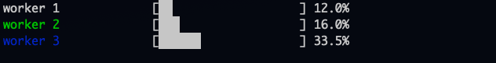

# easybar

`easybar` is a simple Go package that enables creating and displaying progress bars in the terminal. It supports multiple progress bars and dynamic updates.



❗ This project is for **educational** purposes and it is currently not recommended to import this package into your project. It serves as a demonstration of how easy it is to create your own packages in Go.  


## Installation

To install this package, use `go get`:

```bash
go get github.com/lkobylski/easybar
```

## Usage

### Creating and updating a single progress bar

To create a progress bar, call the `NewEasyBar` function. You can then add progress using the `Add()` method:

```go
package main

import (
	"time"
	"github.com/lkobylski/easybar"
)

func main() {
	// Create a progress bar for a task named "Task 1" with a max value of 100
	bar := easybar.NewEasyBar(100, "Task 1")

	// Simulate progress every 100 ms
	for i := 0; i <= 100; i += 10 {
		bar.Add(10)
		time.Sleep(100 * time.Millisecond)
	}
}
```

### Handling multiple progress bars simultaneously

The package supports displaying multiple progress bars at the same time. Use the `UseMultiBars()` function and define the order of the bars using the `WithOrder()` option.

```go
package main

import (
	"time"
	"github.com/lkobylski/easybar"
)

func main() {
	// Enable multi-bar mode
	easybar.UseMultiBars()

	// Create two progress bars
	bar1 := easybar.NewEasyBar(100, "Download File", easybar.WithOrder(1))
	bar2 := easybar.NewEasyBar(200, "Processing Data", easybar.WithOrder(2))

	go func() {
		for i := 0; i <= 100; i += 10 {
			bar1.Add(10)
			time.Sleep(100 * time.Millisecond)
		}
	}()

	go func() {
		for i := 0; i <= 200; i += 20 {
			bar2.Add(20)
			time.Sleep(150 * time.Millisecond)
		}
	}()

	// Wait for both progress bars to complete
	time.Sleep(4 * time.Second)

	// Restore the cursor after completing
	easybar.ClearBars()
}
```

### Customizing the bars

Each progress bar can be customized using options like WithOrder() to define the order in which multiple bars are displayed, or WithColor() to set the color of the progress bar’s name.

```go
bar := easybar.NewEasyBar(100, "My Task",
	easybar.WithOrder(2),
	easybar.WithColor(easybar.ColorGreen), 
	)
```  
**Available colors:**
* `easybar.ColorRed`
* `easybar.ColorGreen`
* `easybar.ColorYellow`
* `easybar.ColorBlue`
* `easybar.ColorReset` (resets to default terminal color)

### Functions

- `NewEasyBar(max int, name string, opts ...Option)`: Creates a new progress bar.
- `Add(val int)`: Adds a value to the current progress of the bar.
- `UseMultiBars()`: Enables the display of multiple progress bars simultaneously.
- `ClearBars()`: Clears the bars and restores the cursor.

## Restoring the cursor

After progress bars are completed, use `ClearBars()` to restore the cursor:

```go
easybar.ClearBars()
```

## License

This project is licensed under the MIT License.